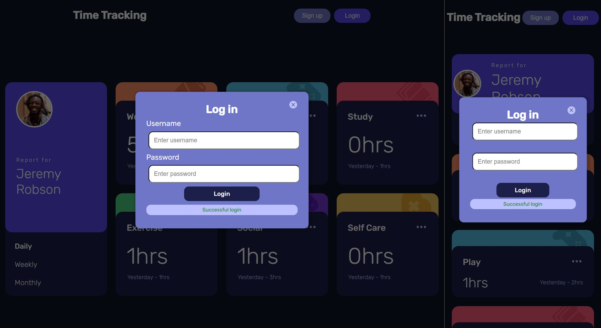
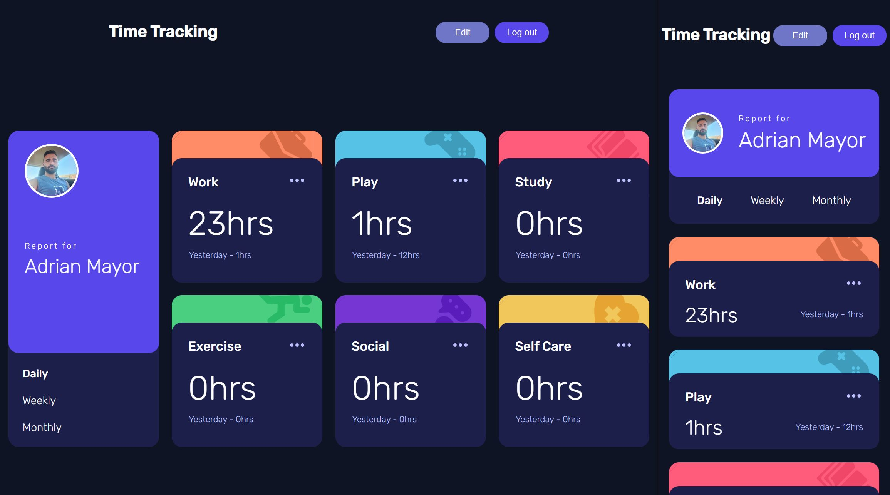
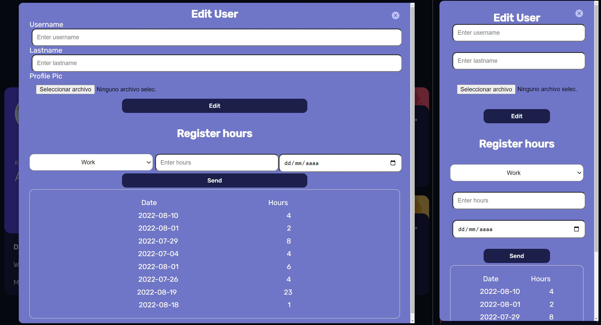

# Frontend Mentor - Time tracking dashboard solution

This is a solution to the [Time tracking dashboard challenge on Frontend Mentor](https://www.frontendmentor.io/challenges/time-tracking-dashboard-UIQ7167Jw). Frontend Mentor challenges help you improve your coding skills by building realistic projects.

## Table of contents

-   [Overview](#overview)
    -   [The challenge](#the-challenge)
    -   [Screenshot](#screenshot)
    -   [Links](#links)
-   [My process](#my-process)
    -   [Built with](#built-with)
    -   [What I learned](#what-i-learned)
-   [Backend](#backend)

## Overview

Application to control the time spent on various activities. This project has helped me develop my design skills and expanded my knowledge of DOM, vanilla JavaScript, CSS as Node.js

### The challenge

Users should be able to:

-   View the optimal layout for the site depending on their device's screen size
-   See hover states for all interactive elements on the page
-   Switch between viewing Daily, Weekly, and Monthly stats
-   Add backend (Extra)

### Screenshots






### Links

-   Live Site URL (just front version): [Click me](https://adrianmayor.github.io/Time-tracking-dashboard/)

## My process

In the first place, I began by presenting the project on paper and in pen, visualizing the requirements that it needed. Once this was clear, I began to program the HTML accompanied by the CSS, to add final functionality with vanilla JS.

I decided to incorporate to this project a small backend composed by Node.js through express; where each user can have his profile and the register of his hours.

With this implementation, it becomes my first Full Stack project.

### Built with

-   Semantic HTML5 markup
-   CSS
-   Flexbox
-   Mobile-first workflow
-   Vanilla JavaScript
-   Node.js Express

### What I learned

I have faced some small challenges that have helped me expand my learning, fluency and comfort barrier when it comes to programming both in the use of BEM in HTML, such as the precise and correct use of CSS, up to an optimal, clear but efficient use of vanilla JavaScript.

Like the combination of both classes via JavaScript to achieve a nice fade out effect when switching between timeframes.

```css
.timeCard__info {
    background-color: var(--mainColor);
    height: 76%;
    width: 100%;
    position: absolute;
    bottom: 0;
    padding: 1.5rem;

    display: grid;
    grid-template-columns: 1fr 1fr;
    transition: ease-in-out 0.1s;
}

.fade {
    opacity: 1;
    transition: opacity 300ms cubic-bezier(0.55, 0.085, 0.68, 0.53);
}
```

```js
async function printHours(event, sentence) {
    const data = await getData();
    selectedTime(event);

    for (let i = 0; i < data.length; i++) {
        const { current, previous } = data[i].timeframes[event];

        currentTime[i].classList.remove('fade');
        recordedTime[i].classList.remove('fade');

        setTimeout(() => {
            currentTime[i].innerHTML = `${current}hrs`;
            recordedTime[i].innerHTML = `${sentence} - ${previous}hrs`;

            currentTime[i].classList.add('fade');
            recordedTime[i].classList.add('fade');
        }, 225);
    }
}
```

### Backend

REST API made with Node.js and its Express extension.

To be able to use and mount this application it is necessary to create the _.env_ file by filling in the data indicated in _.env.example_.

Then it is necessary to create a database in SQL, the names of the .env and the database must match.

Launch the _initDB.js_ file located in the _database_ folder to create all the necessary tables and fields in the database.

Using the console command **npm run dev** launch the server.
